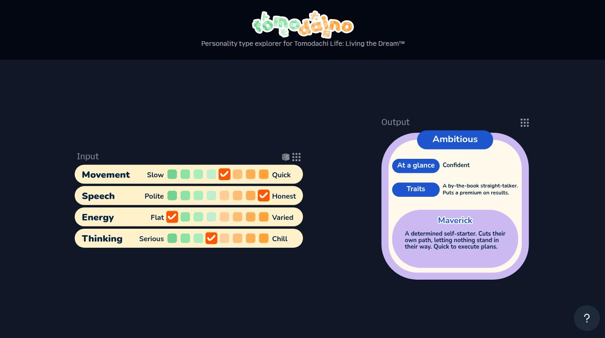

# 
Web app for exploring the Tomodachi Life: Living the Dream™ personality system

## Usage
- Go to the website [here](https://github.io/WasabiThumb/tomodaino)
- Click the ``?`` icon in the bottom right for more info
- Have fun!

## Sample


## Roadmap
- Better mobile support (pinch gestures are TODO)
- Option to create graph visualization widgets
- Right click/long hold context menu

## License
```text
Copyright 2026 Xavier Pedraza

Licensed under the Apache License, Version 2.0 (the "License");
you may not use this file except in compliance with the License.
You may obtain a copy of the License at

    http://www.apache.org/licenses/LICENSE-2.0

Unless required by applicable law or agreed to in writing, software
distributed under the License is distributed on an "AS IS" BASIS,
WITHOUT WARRANTIES OR CONDITIONS OF ANY KIND, either express or implied.
See the License for the specific language governing permissions and
limitations under the License.
```
